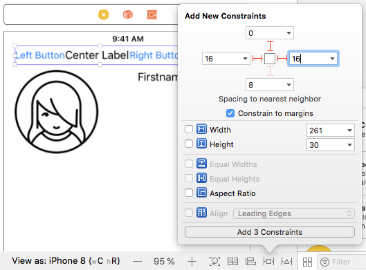
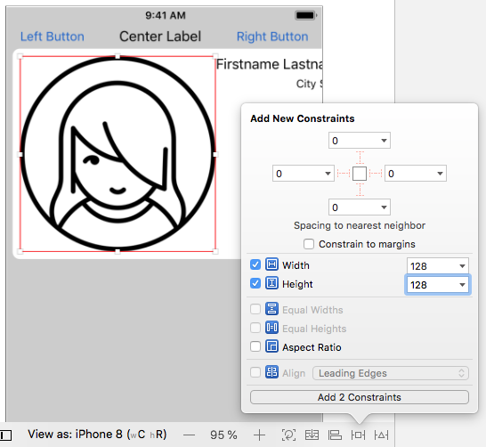
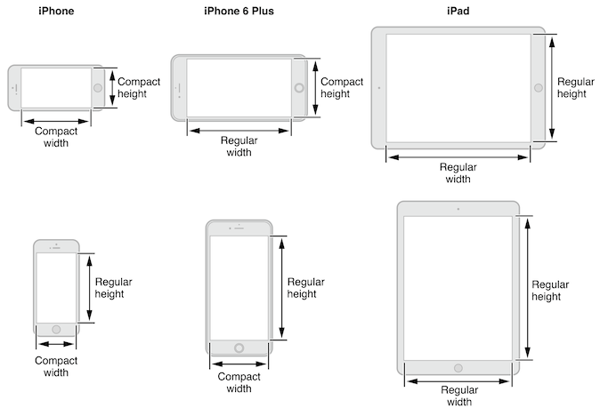
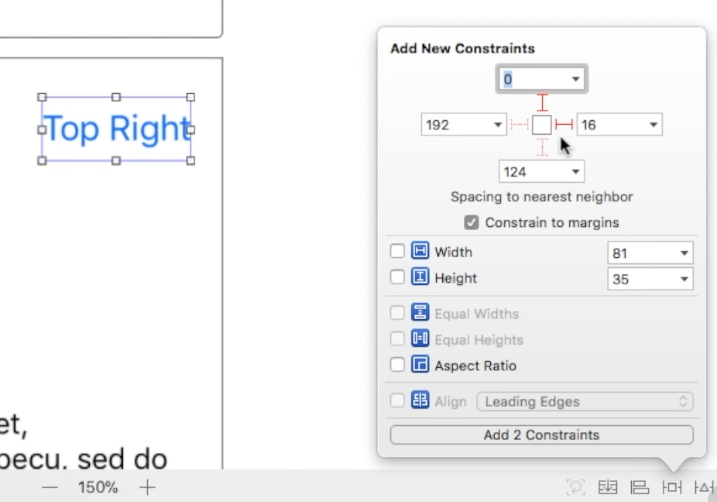
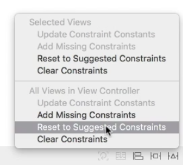
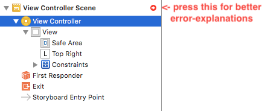

# iOS Adaptive UI examples

Some notes and guidance on how to do basic layouts in Xcode by using for example Auto Layout.

# BasicLayout.storyboard

* "Top Left" and "Bottom Left" -> Ctrl + drag to left side and select `Trailing space to Safe Area`
* "Top Right" and "Bottom Right" -> Ctrl + drag to right side and select `Trailing space to Safe Area`
* "Top Left" and "Top Right" -> Ctrl + drag to upwards and select `Top space to Safe Area`
* "Bottom Left" and "Bottom Right" -> Ctrl + drag to downwards and select `Bottom space to Safe Area`

* "Center Label" -> Ctrl + drag to left and select `Center Horizontally in Safe Area`
* "Center Label" -> Ctrl + drag to upwards and select `Top space to Safe Area`
* "Text Area" -> Ctrl + drag to left side and select `Trailing space to Safe Area`
* "Text Area" -> Ctrl + drag to right side and select `Trailing space to Safe Area`
* "Text Area" -> Ctrl + drag to "Center Label" and select `Vertical Spacing`
* "Text Area" -> Ctrl + drag to "Text Area" ITSELF and select `Height`

# StackView.storyboard

Add Constraints to label-stack at the top of the screen: 

After adding the image view into the horizontal stack view, it was shown in its real size (466x466). Add the new width and height constraints (128x128) to image view:

# Traits and Size Classes

Steps for adding traits:
1. View the storyboard in the width and height size class you want. In this example, select iPhone 4s in landscape orientation
2. Click "Vary for Traits"
    
    If you only check **width** box, then the changes will affect everything with whatever width size class I'm looking at right now -> In this case **compact**
3. Select **width** and the bar shows that action is a custom variation only affecting certain size classes

## iOS Size Classes
* regular and compact
* iPhones (portrait orientation): width: **compact**, height: **regular**
    * In portrait mode, even a small iPhone is perfectly usable, even with large amounts of content -> You're NOT constrained
    * Vertical scrolling is easy
    * Horizontal scrolling, moving left to right, is not good -> therefore it is considered as **compact**
* iPhones (landscape orientation): width: **compact**, height: **compact**
* ***EXCEPTION***: iPhone PLUS (landscape orientation): width: **regular**, height: **compact**

# Other

## Use `Add New Constraints`

Alternatively you can use `Add New Constraints` selection at the bottom of the screen: 

(top and right constrains selected)

## Use `Resolve Auto Layout Issues`

You can clear all constraints for selected element OR all views by selecting `Clear Constraints`.

Also you can ask Xcode to make its **best guess** at adding constraints for all items:

Test it!
Do
* `Clear Constraits`
* `Reset to Suggested Constraints`

in `All Views in View Controller` and see what happens.

## Notifications

## Links

[Understanding Auto Layout - Apple Developer Pages](https://developer.apple.com/library/archive/documentation/UserExperience/Conceptual/AutolayoutPG/index.html)